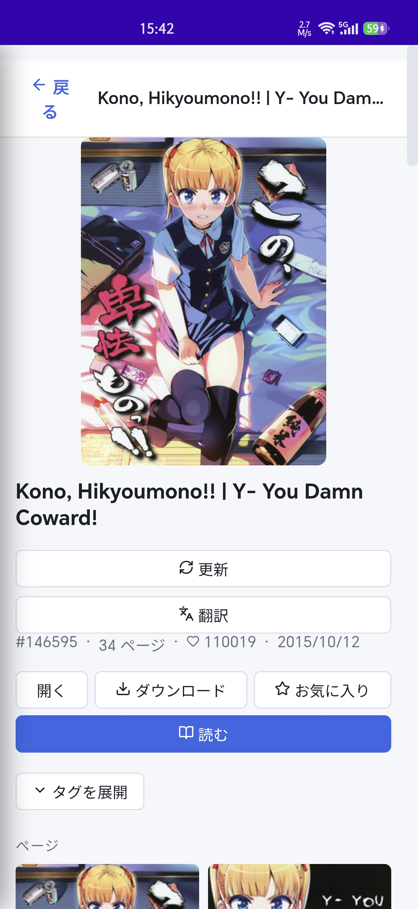
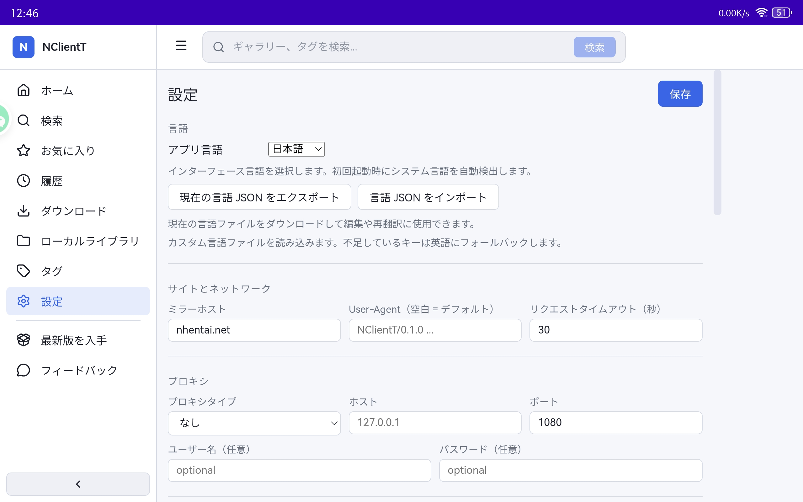

# NClientT

[English](README.md) | [简体中文](README_zh.md)

[](https://github.com/msprivate67-commits/NClientT/releases/latest)
[](LICENSE)

**NClientT** 是一款非官方的 [nhentai](https://nhentai.net) 跨平台客户端，提供浏览、搜索、阅读和下载画廊等功能。支持 Android、Windows、macOS 和 Linux，是 [NClientV3](https://github.com/maxwai/NClientV3) 基于 Tauri 2 与 Vue 3 的完整重写版本。

> ⚠️ 本项目仅供个人学习与使用。请遵守 nhentai 的服务条款以及你所在地区的法律法规。

## 支持的平台

<p align="center">
  
  
  
  
</p>

## 技术栈

- Rust 与 Tauri 2：原生应用外壳和后端功能
- Vue 3、TypeScript 与 Pinia：前端界面和状态管理
- SQLite：收藏、历史、标签和下载记录
- Vue I18n：多语言支持

## 下载

请前往 [最新 Release](https://github.com/msprivate67-commits/NClientT/releases/latest) 下载适用于当前版本的安装包。

官方 Android APK 面向现代 64 位 ARM 设备（`arm64-v8a`）。旧款 32 位 ARM 设备（`armeabi-v7a`）请按照下方“编译旧版 Android APK”章节自行构建。

## 手机截图

<div align="center">
  
  
  
</div>

<div align="center">
  
</div>

## 平板截图

<div align="center">
  
  <br/>
  
</div>

## 主要功能

- **浏览**：查看最近更新和今日、本周、本月、全部热门内容
- **搜索**：按标题、关键词或标签搜索，支持包含/排除标签、语言和页数筛选
- **随机画廊**：发现随机内容
- **阅读器**：适应宽度、适应高度、原始尺寸、分页阅读、RTL 和键盘操作
- **下载管理**：并发下载、暂停、继续、取消和进度跟踪
- **下载通知**：Android 下载进度与完成通知
- **收藏**：本地离线收藏和需要 API Key 的在线收藏
- **历史记录**：自动记录浏览过的画廊
- **本地库**：扫描已下载内容并离线浏览元数据
- **标签管理**：缓存、搜索以及包含/排除标签
- **Cloudflare 验证**：在内置 WebView 中完成验证并复用 Cookie
- **隐私保护**：Android 可阻止截图、录屏和最近任务预览
- **导出**：将下载内容导出为 PDF 或 ZIP

## 开发者指南

### 环境要求

- [Rust 1.77+](https://rustup.rs/)
- [Node.js 18+](https://nodejs.org/)
- 对应平台的 [Tauri 开发依赖](https://tauri.app/start/prerequisites/)

### 快速开始

```bash
git clone https://github.com/msprivate67-commits/NClientT.git
cd NClientT
npm ci

# 启动完整桌面应用开发环境
npm run tauri:dev

# 构建当前桌面平台安装包
npm run tauri:build
```

只开发前端时可运行 `npm run dev`。提交代码前建议执行：

```bash
npm run typecheck
npm run build
cargo check --manifest-path src-tauri/Cargo.toml
cargo test --manifest-path src-tauri/Cargo.toml
```

### 编译旧版 Android APK

官方 Release 中的 Android APK 为 `arm64-v8a`，适用于现代 64 位 ARM 设备。如果旧手机或平板使用 32 位 ARM 处理器，可构建 `armeabi-v7a` 版本。

> 该版本只解决 32 位 ARM 架构兼容问题，最低系统版本仍为 Android 7.0（API 24），不支持 Android 6.0 及更早版本。

首先按照 [Tauri Android 开发文档](https://tauri.app/start/prerequisites/) 安装 Android SDK、NDK 和 Java，并配置 `ANDROID_HOME` 及 NDK 环境变量，然后运行：

```bash
npm ci
npm run android:build:legacy
```

脚本会自动完成以下工作：

1. 安装 Rust 的 `armv7-linux-androideabi` 编译目标（如果尚未安装）。
2. 构建 `armeabi-v7a` Release APK。
3. 在存在 `src-tauri/nclientt.keystore` 和 Android `apksigner` 时签名并验证 APK。
4. 将最终文件写入：

```text
artifacts/NClientT-<版本号>-android-armeabi-v7a.apk
```

若要使用自己的签名密钥，请在运行脚本前设置：

- `ANDROID_KEYSTORE_PATH`：密钥库路径
- `ANDROID_KEYSTORE_PASSWORD`：密钥库密码
- `ANDROID_KEY_ALIAS`：密钥别名
- `ANDROID_KEY_PASSWORD`：密钥密码，可选，默认与密钥库密码相同

如果找不到签名工具或密钥库，脚本仍会保留带有 `-unsigned.apk` 后缀的未签名 APK。未签名 APK 不能直接作为正式安装包发布。

### 平台依赖

| 平台 | 额外依赖 |
|------|----------|
| Windows | Visual Studio Build Tools（“使用 C++ 的桌面开发”）和 WebView2 |
| macOS | `xcode-select --install` |
| Linux | `webkit2gtk`、`libssl-dev`、`librsvg2` 等 |

第一次构建通常需要 5–15 分钟，之后会复用缓存。

## 项目结构

```text
NClientT/
├── src/                       # Vue 3 前端
│   ├── api/                   # 按领域拆分的 Tauri/服务调用层
│   ├── components/            # 可复用组件
│   ├── composables/           # 可复用交互逻辑
│   ├── i18n/                  # 多语言
│   ├── stores/                # Pinia 状态
│   ├── types/                 # 前端共享类型
│   └── views/                 # 页面
├── src-tauri/                 # Rust 后端与原生平台项目
├── scripts/                   # 图标和构建脚本
├── docs/                      # 架构文档
├── README.md                  # 英文说明
└── README_zh.md               # 中文说明
```

前端统一从 `@/api` 导入后端操作。模块职责与依赖规则请参阅 [`docs/FRONTEND_ARCHITECTURE.md`](docs/FRONTEND_ARCHITECTURE.md)，NClientV3 到 NClientT 的迁移和后端架构请参阅 [`docs/ARCHITECTURE.md`](docs/ARCHITECTURE.md)。

## API Key（可选）

浏览、搜索、阅读和下载无需 API Key。在线收藏和评论功能需要在“设置 → API Key 身份验证”中填写 API Key。

## Cloudflare

当网站启用 Cloudflare 验证时，程序会提示进行验证。点击“立即验证”，在打开的 WebView 中完成验证码，程序会保存 `cf_clearance` Cookie 并用于后续请求。

## 从 NClientV3 迁移

NClientT 是完全重写版本，并非直接升级。下载目录结构和 API 接口保持兼容，因此已下载内容可以继续使用；设置与收藏不会自动迁移，需要重新配置。

## 许可证

[Apache-2.0](LICENSE)，与 NClientV3 相同。
